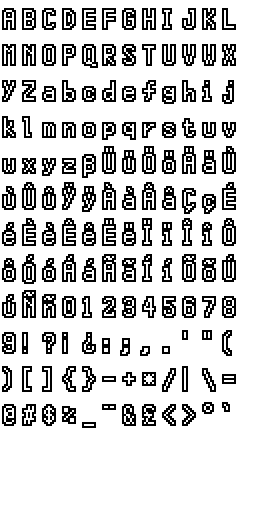

# Solver



## Description

Solver is a pixel art font inspired by [Silver](https://poppyworks.itch.io/silver) Font.
It is used in many of our Construct 3 examples and is well suited for retro-style games, UI, and pixel art projects.

We distribute two sizes of the font: **Complete** and **Reduced**. **Complete** includes accents and additional special characters, while **Reduced** provides a compact character set containing only what we need to build our examples.

Inside the folders, you will find the Aseprite and PNG files for bare, outlined, and drop shadowed versions of each size.

## Construct 3 Settings
For use with a **SpriteFont** object in Construct 3, we recommend the following settings:

### Complete

Character Width: `10`

Character Height: `18`

Character Set:

```
ABCDEFGHIJKLMNOPQRSTUVWXYZabcdefghijklmnopqrstuvwxyzßÜüÖöÄäÙùÛûŸÿÀàÂâÇçÉéÈèÊêËëÏïÎîÔôÓóÁáÃãÍíÕõÚúÑñ0123456789!?¡¿:;,.'"()[]{}-+*/|\\=@#$%_¨&£<>°'
```
Spacing Data:

```
[[5," "],[4,"!''|"],[6,"IliÏïÎîÍí1:;,.\\"`()[]"],[7,"j°"],[8,"ABCDEFGHJKLMNOPRSTUVWXYZabcdefghkmnopqrstuvwxyzßÜüÖöÄäÙùÛûŸÿÀàÂâÇçÉéÈèÊêËëÔôÓóÁáÃãÕõÚúÑñ023456789?¿{}-+*/=@#$%_¨&£<>"],[9,"Q"]]
```
Character Spacing: `-2`

Line Height: `-3`

### Reduced

Character Width: `11`

Character Height: `15`

Character Set:

```
ABCDEFGHIJKLMNOPQRSTUVWXYZabcdefghijklmnopqrstuvwxyz0123456789.,;:?!-_~#"'&()[]|`\\/@°+=*$£<>%
```
Spacing Data:

```
[[5," "],[4,"!'|"],[5,"`"],[6,"Iil1.,;:\\"()[]"],[7,"j°"],[8,"ABCDEFGHJKLMNOPRSTUVWXYZabcdefghkmnopqrstuvwxyz023456789?-_#&\\\\/@+=*$£<>%"],[9,"Q~"]]
```
Character Spacing: `-2`

Line Height: `0`

## License
Solver is released into the public domain. You may use it freely in personal or commercial projects, with no attribution required.

